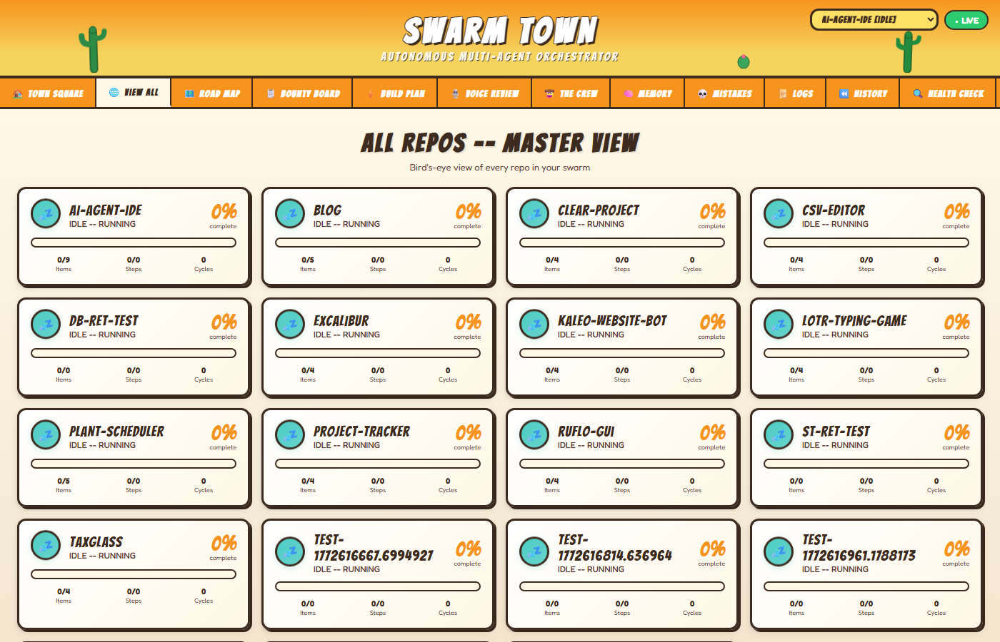
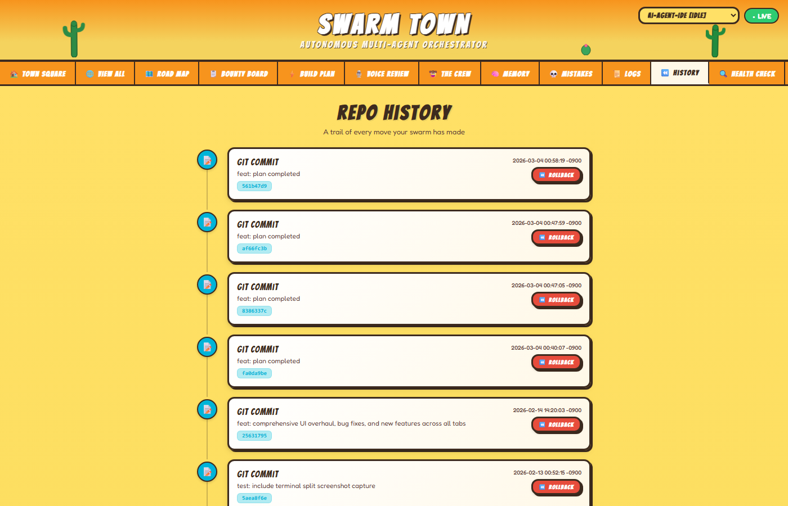
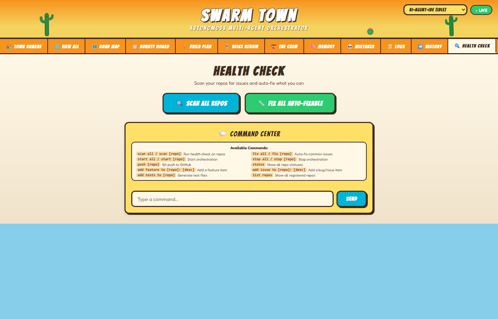
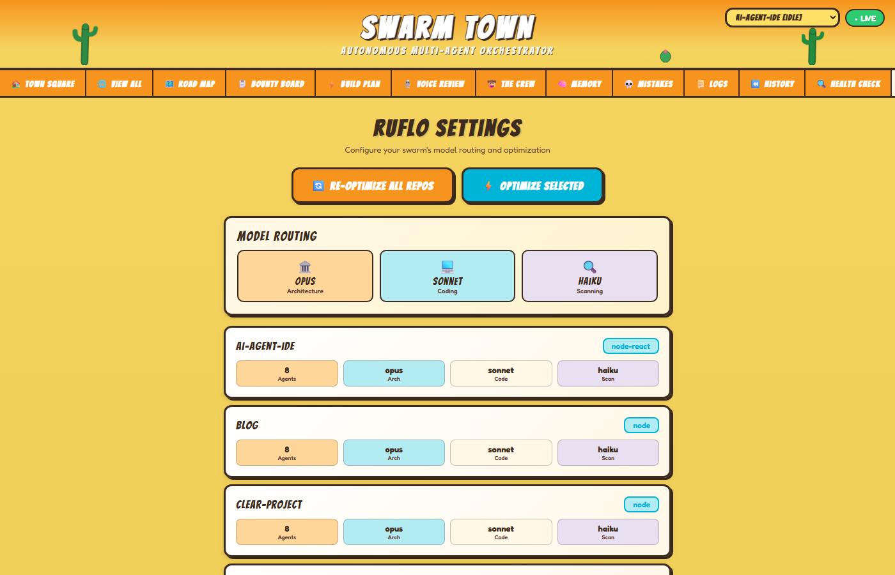

<p align="center">
  
</p>

<h1 align="center">SWARM TOWN</h1>

<p align="center">
  <strong>Autonomous Multi-Repo Coding Orchestrator</strong><br/>
  <em>Powered by Ruflo, Claude Code & Ralph Wiggum Loops</em>
</p>

<p align="center">
  
  
  
  
  
</p>

<p align="center">
  
</p>

---

## What Is This?

**One click. Walk away. Your repos get built, tested, and pushed to GitHub — automatically.**

Swarm Town orchestrates 10+ AI agents per repository in parallel across your entire codebase. It handles credit exhaustion gracefully, accepts voice code reviews via Telegram, learns from its mistakes, and ships working code to GitHub while you sleep.

> Think of it as a small desert town where AI cowboys work 24/7 building your software.

---

## Features

| Feature | Description |
|---------|-------------|
| **Multi-Repo Parallel** | Every repo runs its own orchestrator thread with isolated SQLite database |
| **17-State Machine** | Full lifecycle: audio intake, refactoring, planning, building, testing, optimization |
| **Voice Reviews** | Record audio, Whisper transcribes, items auto-extracted into the pipeline |
| **Telegram Bot** | Control everything from your phone — start/stop, voice notes, screenshots, daily digests |
| **Telegram Mini App** | Full mobile dashboard inside Telegram with all 6 screens |
| **Credit Recovery** | Detects API credit exhaustion, pauses gracefully, auto-resumes when credits return |
| **Mistake Memory** | Errors logged via Ruflo and injected into future prompts to prevent repeats |
| **Model Routing** | Opus for architecture, Sonnet for coding, Haiku for scanning — automatically |
| **Quality Gates** | Pre-commit, pre-push, and security scans before every git push |
| **Ruflo Swarms** | 215 MCP tools, 10+ agent types (researcher, coder, tester, architect, reviewer) |
| **Ralph Loops** | Persistent autonomous execution with stop-hook completion promises |
| **Live Dashboard** | Los Lunas cartoon-style UI with real-time state visualization |
| **Health Scanner** | Automated repo health checks with one-click auto-fix for common issues |
| **API Security** | Bearer tokens, Telegram signature validation, chat ID whitelisting |
| **History & Rollback** | Full action + git history per repo with one-click rollback to any commit |
| **Chat Bridge** | Telegram-to-Claude Code bidirectional messaging via file-based bridge |
| **Auto-Start** | Launches on system boot, runs headlessly, no popup windows |

---

## Screenshots

<table>
  <tr>
    <td align="center"><strong>Town Square</strong><br/></td>
    <td align="center"><strong>View All</strong><br/></td>
  </tr>
  <tr>
    <td align="center"><strong>Road Map</strong><br/></td>
    <td align="center"><strong>Bounty Board</strong><br/></td>
  </tr>
  <tr>
    <td align="center"><strong>Build Plan</strong><br/></td>
    <td align="center"><strong>Voice Review</strong><br/></td>
  </tr>
  <tr>
    <td align="center"><strong>The Crew</strong><br/></td>
    <td align="center"><strong>Memory</strong><br/></td>
  </tr>
  <tr>
    <td align="center"><strong>Mistakes</strong><br/></td>
    <td align="center"><strong>Logs</strong><br/></td>
  </tr>
  <tr>
    <td align="center"><strong>History</strong><br/></td>
    <td align="center"><strong>Health Check</strong><br/></td>
  </tr>
  <tr>
    <td align="center"><strong>Settings</strong><br/></td>
    <td align="center"></td>
  </tr>
</table>

---

## Architecture

```
                    ┌──────────────────────────┐
                    │    Dashboard (React)      │
                    │   localhost:6969          │
                    └──────────┬───────────────┘
                               │ REST API
                    ┌──────────┴───────────────┐
                    │   Orchestrator (Python)   │
                    │   + Auth (Bearer Token)   │
                    └──────────┬───────────────┘
              ┌────────────────┼────────────────┐
              │                │                │
     ┌────────┴──────┐  ┌─────┴─────┐  ┌───────┴───────┐
     │  Master DB    │  │  Telegram  │  │   Ngrok       │
     │  (registry)   │  │  Bot + MCP │  │   Tunnel      │
     └───────────────┘  └───────────┘  └───────────────┘
              │
    ┌─────────┼─────────┬─────────┬─────────┐
    │         │         │         │         │
  ┌─┴──┐   ┌─┴──┐   ┌─┴──┐   ┌─┴──┐   ┌─┴──┐
  │Repo│   │Repo│   │Repo│   │Repo│   │... │
  │ DB │   │ DB │   │ DB │   │ DB │   │    │
  └─┬──┘   └─┬──┘   └─┬──┘   └─┬──┘   └────┘
    │         │         │         │
    └─────────┴────┬────┴─────────┘
                   │
         ┌─────────┼─────────┐
         │         │         │
      Ruflo     Claude    Ralph
      Swarms    Code      Loop
      (215      (Opus/    (50 iter
       tools)   Sonnet/   persistent)
                Haiku)
```

## State Machine

```
┌──────┐     ┌───────────┐     ┌────────────┐     ┌─────────────┐
│ IDLE ├────►│CHECK_AUDIO├────►│ TRANSCRIBE ├────►│ PARSE_ITEMS │
└───┬──┘     └─────┬─────┘     └────────────┘     └──────┬──────┘
    │              │ No audio                              │
    │              ▼                                       │
    │        ┌─────────────┐     ┌─────────────┐          │
    │        │CHECK_REFACTOR├───►│ DO_REFACTOR │          │
    │        └──────┬──────┘     └──────┬──────┘          │
    │               │                    │                 │
    │               ▼                    ▼                 │
    │        ┌──────────────┐    ┌────────────┐           │
    │        │CHECK_NEW_ITEMS├──►│UPDATE_PLAN │◄──────────┘
    │        └──────┬───────┘    └─────┬──────┘
    │               ▼                  │
    │        ┌──────────────────┐      │
    │        │CHECK_PLAN_COMPLETE│◄─────┘
    │        └──────┬───────────┘
    │               ▼
    │        ┌──────────────┐     ┌───────────┐
    │        │ EXECUTE_STEP ├────►│ TEST_STEP │
    │        └──────────────┘     └─────┬─────┘
    │                                   ▼
    │        ┌────────────────┐  ┌──────────────┐
    │        │CHECK_MORE_ITEMS│◄─┤CHECK_STEPS_LEFT│
    │        └───────┬────────┘  └──────────────┘
    │                ▼
    │        ┌───────────────┐   ┌───────────┐
    │        │FINAL_OPTIMIZE ├──►│ SCAN_REPO │
    │        └───────────────┘   └─────┬─────┘
    │                                  │
    └──────────────────────────────────┘

    ⚠️ Any state ──► CREDITS_EXHAUSTED (auto-resume when refilled)
```

---

## Quick Start

> **Recommended:** If you have [Claude Code](https://docs.anthropic.com/en/docs/claude-code) installed, just open this project and tell Claude to set it up for you. It will handle everything automatically.

### Prerequisites

- Python 3.10+
- Node.js 18+
- [Claude Code CLI](https://docs.anthropic.com/en/docs/claude-code) — `npm install -g @anthropic-ai/claude-code`
- [Ruflo](https://ruflo.dev) — `npm install -g ruflo@latest`

### Install

```bash
git clone https://github.com/hotredsam/Orchestrator.git
cd Orchestrator
pip install -r requirements.txt
playwright install chromium  # for screenshots
```

### Run

```bash
# Full auto mode — starts all repos + Telegram bot
python orchestrator.py --start-all --telegram

# Server only — add repos via dashboard
python orchestrator.py --server-only

# Dashboard: http://localhost:6969
```

### Desktop Launcher

| Platform | Command |
|----------|---------|
| **Windows** | Double-click `scripts/launch-swarm.bat` |
| **macOS** | Double-click `scripts/Swarm Orchestrator.command` |
| **Linux** | Run `scripts/launch-swarm.sh` |

The launcher auto-detects if the server is already running and just opens the dashboard.

---

## Setup Guide (Step by Step)

Follow these steps in order. Each step tells you exactly what to do.

### Step 1: Install Python

1. Go to [python.org/downloads](https://python.org/downloads)
2. Click the big yellow **Download Python** button
3. Run the installer
4. **Important:** Check the box that says **"Add Python to PATH"** before clicking Install
5. Click **Install Now** and wait for it to finish

**To verify:** Open a terminal (search "Terminal" or "Command Prompt" on your computer) and type:
```bash
python --version
```
You should see something like `Python 3.12.x`. If it says "not found", restart your computer and try again.

### Step 2: Install Node.js

1. Go to [nodejs.org](https://nodejs.org)
2. Click the **LTS** (Long Term Support) download button
3. Run the installer — click Next through everything, keep all defaults
4. Restart your terminal

**To verify:**
```bash
node --version
```
You should see something like `v22.x.x`.

### Step 3: Install Claude Code

In your terminal, type:
```bash
npm install -g @anthropic-ai/claude-code
```
Wait for it to finish downloading. This is the AI that powers the agents.

### Step 4: Install Ruflo

In your terminal, type:
```bash
npm install -g ruflo@latest
```
This is the swarm orchestration framework that coordinates the agents.

### Step 5: Download Swarm Town

In your terminal, type:
```bash
git clone https://github.com/hotredsam/Orchestrator.git
cd Orchestrator
```
This downloads all the code to your computer.

> **Don't have git?** Download it from [git-scm.com](https://git-scm.com/downloads) and install it first.

### Step 6: Install Python Packages

Still in the same terminal (inside the Orchestrator folder), type:
```bash
pip install -r requirements.txt
```
This installs all the extra Python tools that Swarm Town needs.

### Step 7: Set Up Your Secrets (Optional — for Telegram)

1. Find the file called `.env.example` in the project folder
2. Make a copy of it and rename the copy to `.env`
3. Open `.env` in any text editor (Notepad works fine)
4. Replace the placeholder values with your actual Telegram bot token and chat ID
5. Save the file

> **Skip this step** if you don't plan to use Telegram. Everything else works without it.

### Step 8: Install Screenshot Tool (Optional)

If you want the dashboard screenshot feature:
```bash
playwright install chromium
```

### Step 9: Start Swarm Town

```bash
python orchestrator.py --server-only
```

You should see a message that the server is running.

### Step 10: Open the Dashboard

Open your web browser and go to:
```
http://localhost:6969
```

You should see the Swarm Town dashboard with a desert-themed UI. From here you can:
- Add your code repositories using the dashboard
- Start the AI agents on any repo
- Monitor progress in real time

### Troubleshooting

| Problem | Solution |
|---------|----------|
| "python not found" | Reinstall Python and make sure "Add to PATH" is checked |
| "npm not found" | Reinstall Node.js and restart your terminal |
| "port 6969 already in use" | Close any other program using that port, or restart your computer |
| Dashboard shows blank page | Make sure the server is running in your terminal (check for error messages) |
| Telegram not working | Double-check your `.env` file has the correct bot token and chat ID |

---

## Dashboard Tabs

| Tab | Description |
|-----|-------------|
| **Town Square** | All repos at a glance — stats, progress bars, start/stop |
| **View All** | Master view of all repo roadmaps with live progress |
| **Road Map** | Interactive state machine diagram showing current position |
| **Bounty Board** | Features and issues with priorities and status tracking |
| **Build Plan** | Step-by-step execution plan with test results |
| **Voice Review** | Record or upload audio for AI-powered code review |
| **The Crew** | Active agent grid showing what each agent is doing |
| **Memory** | Ruflo memory banks — namespace/key/value with search |
| **Mistakes** | Error graveyard — injected into prompts to prevent repeats |
| **Logs** | Full execution history with timestamps and durations |
| **Health Check** | Repo health scanner with one-click auto-fix |
| **History** | Full action + git commit history with one-click rollback |
| **Settings** | Ruflo config per repo, re-optimize all repos, model routing display |

### Command Center

Type natural language commands in the chat:

```
scan all           — Run health check on all repos
fix all            — Auto-fix common issues
start all          — Start orchestration on all repos
stop all           — Stop everything
push blog          — Git push specific repo
add feature to blog: dark mode  — Add a feature item
add issue to api: fix auth      — Add a bug report
status             — Show all repo statuses
list repos         — List registered repositories
```

---

## Telegram Integration

### Bot Commands

| Command | Action |
|---------|--------|
| `status` | All repo states and stats |
| `start all` / `start [repo]` | Launch orchestration |
| `stop all` / `stop [repo]` | Stop orchestration |
| `screenshot` | Dashboard screenshot sent as photo |
| `add feature repo: title - desc` | Add a feature item |
| `add issue repo: title - desc` | Add a bug report |
| `push [repo]` | Git push to GitHub |
| Voice message | Transcribed and items auto-extracted |

### Mini App

Tap the menu button in Telegram to open the full dashboard on mobile:

- 6 screens: Home, Add Item, Flow Map, Health Check, Chat, Stats
- Haptic feedback on all actions
- Dark mode support
- Real-time updates every 3 seconds

### MCP Server

The Telegram MCP server is registered globally in Claude Code. Any Claude session can send messages:

```
Tools available: telegram_send_message, telegram_send_photo,
telegram_send_document, telegram_get_updates, telegram_get_chat_info
```

---

## Model Routing

| Task | Model | Why |
|------|-------|-----|
| Architecture & Refactoring | `claude-opus-4-6` | Critical decisions need the best |
| Planning & Updates | `claude-opus-4-6` | Plan quality determines everything |
| Code Execution | `claude-sonnet-4-6` | Fast, capable, cost-effective |
| Testing | `claude-sonnet-4-6` | Needs to understand code well |
| Optimization & Cleanup | `claude-haiku-4-5` | Quick and cheap for simple tasks |
| Scanning & Parsing | `claude-haiku-4-5` | High volume, low complexity |

---

## Security

Three layers of API security when exposed via tunnel:

1. **Bearer Token** — Random token generated on startup, required on all API requests
2. **Telegram Validation** — HMAC-SHA256 verification of Telegram initData signatures
3. **Chat ID Whitelist** — Only your Telegram account can access the API

---

## Project Structure

```
swarm-town/
├── orchestrator.py          # Main backend — API, state machine, orchestration
├── swarm-dashboard.jsx      # React dashboard (Babel standalone)
├── index.html               # Dashboard HTML shell
├── README.md                # You are here
├── requirements.txt         # Python dependencies
├── scripts/                 # Launchers and utilities
│   ├── launch-swarm.bat     # Windows launcher
│   ├── launch-swarm.sh      # Linux/Mac launcher
│   ├── Swarm Orchestrator.command  # macOS Finder launcher
│   ├── swarm-startup.vbs    # Silent Windows auto-start
│   └── ...
├── .env.example             # Environment variable template
├── bot/                     # Telegram integration
│   ├── telegram_bot.py      # Two-way Telegram bot
│   ├── telegram-mcp-server.js  # MCP server (copy lives in ~/Desktop/Telegram Bot/)
│   └── telegram-app.html    # Telegram Mini App
├── tests/                   # Test suite
│   └── test_swarm.py        # 500+ tests
├── docs/                    # Documentation
│   ├── architecture.md      # System architecture
│   ├── api-reference.md     # API endpoints
│   ├── CHANGELOG.md         # Version history
│   └── screenshots/         # Dashboard screenshots
└── assets/                  # Icons and media
    └── cactus.ico           # App icon
```

---

## API Reference

See [docs/api-reference.md](docs/api-reference.md) for the complete API documentation.

### Key Endpoints

| Method | Path | Description |
|--------|------|-------------|
| `GET` | `/api/repos` | List all repos with state and stats |
| `POST` | `/api/repos` | Register a new repository |
| `POST` | `/api/start` | Start orchestration (one or all) |
| `POST` | `/api/stop` | Stop orchestration |
| `POST` | `/api/items` | Add a feature or issue |
| `GET` | `/api/plan?repo_id=N` | Get build plan steps |
| `GET` | `/api/agents?repo_id=N` | Active agents for repo |
| `GET` | `/api/memory?repo_id=N` | Memory entries |
| `GET` | `/api/health-scan` | Health check all repos |
| `POST` | `/api/fix-all` | Auto-fix all issues |
| `POST` | `/api/chat` | Natural language command |
| `GET` | `/api/history?repo_id=N` | Action + git commit history |
| `POST` | `/api/rollback` | Rollback repo to a commit |
| `POST` | `/api/ruflo-optimize` | Re-optimize Ruflo settings |
| `GET/POST` | `/api/bridge/inbox` | Chat bridge inbox |
| `GET/POST` | `/api/bridge/outbox` | Chat bridge outbox |
| `GET` | `/telegram-app` | Telegram Mini App |

---

## Testing

```bash
# Run the full test suite (500+ tests)
python -m pytest tests/test_swarm.py -v --tb=short

# Quick summary
python -m pytest tests/test_swarm.py -q
```

Tests run without a server — everything is mocked. Covers: state machine, databases, runner, API, chat commands, health scanner, Telegram bot, model routing, edge cases, and integration.

---

## Tech Stack

| Layer | Technology |
|-------|-----------|
| **Backend** | Python 3.10+, stdlib HTTP server, SQLite WAL |
| **Frontend** | React 18 (CDN), Babel standalone, Google Fonts |
| **AI** | Claude Code CLI, Ruflo v3.5, Ralph Wiggum loops |
| **Models** | Claude Opus 4.6 / Sonnet 4.6 / Haiku 4.5 |
| **Audio** | OpenAI Whisper |
| **Screenshots** | Playwright (headless Chromium) |
| **Notifications** | Telegram Bot API + MCP Server |
| **Mobile** | Telegram Mini App (WebApp SDK) |
| **Security** | HMAC-SHA256, Bearer tokens, IP whitelisting |
| **VCS** | Git with auto-push |

---

## Acknowledgments

Swarm Town stands on the shoulders of these incredible projects and their creators:

| Project | Creator | Description |
|---------|---------|-------------|
| **[Ruflo](https://github.com/ruvnet/ruflo)** | [Reuven Cohen (rUv)](https://github.com/ruvnet) | Agent orchestration platform for Claude — 215 MCP tools, 60+ specialized agents, enterprise-grade multi-agent swarms |
| **[Everything Claude Code](https://github.com/affaan-m/everything-claude-code)** | [Affaan Mustafa](https://github.com/affaan-m) | Agent harness performance optimization — skills, instincts, memory, security, and research-first development patterns |
| **[Ralph Wiggum Technique](https://ghuntley.com/ralph/)** | [Geoffrey Huntley](https://github.com/ghuntley) | Persistent autonomous coding loop methodology — iterative self-improving AI development cycles |

---

## License

MIT — see [docs/LICENSE](docs/LICENSE)

---

<p align="center">
  <em>Built with Claude Code by the citizens of Swarm Town</em> 🌵
</p>
