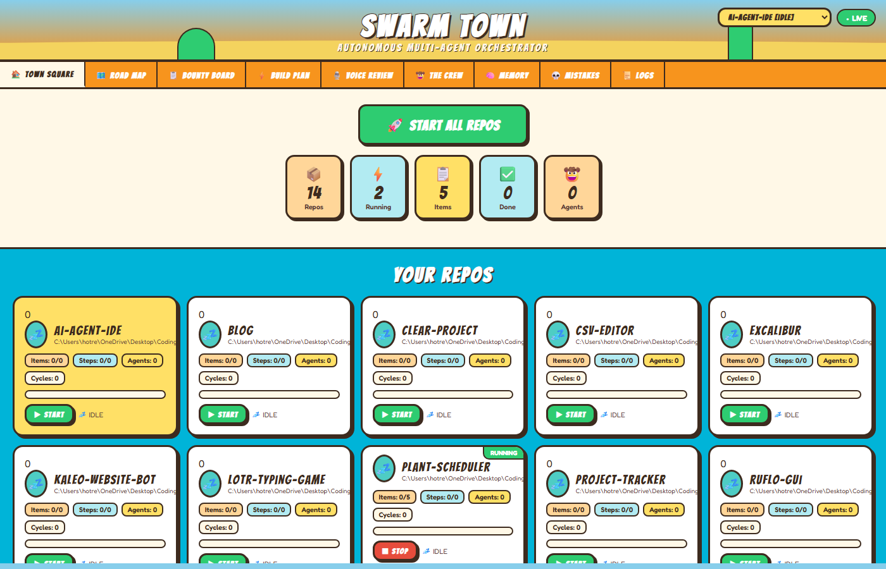
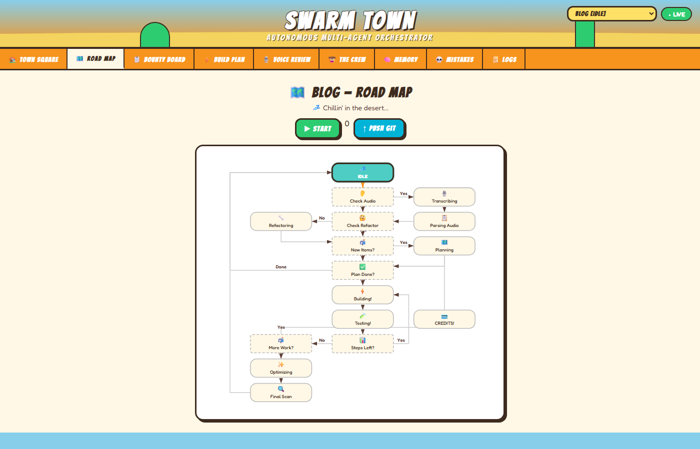
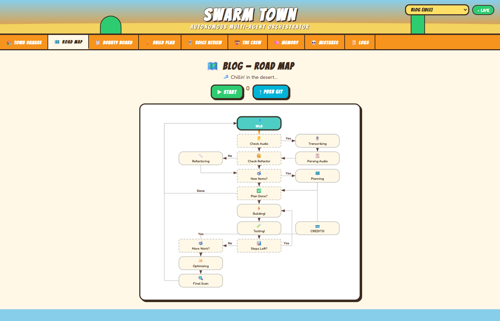
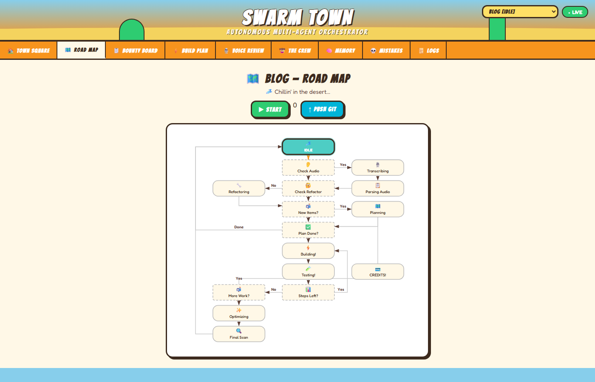
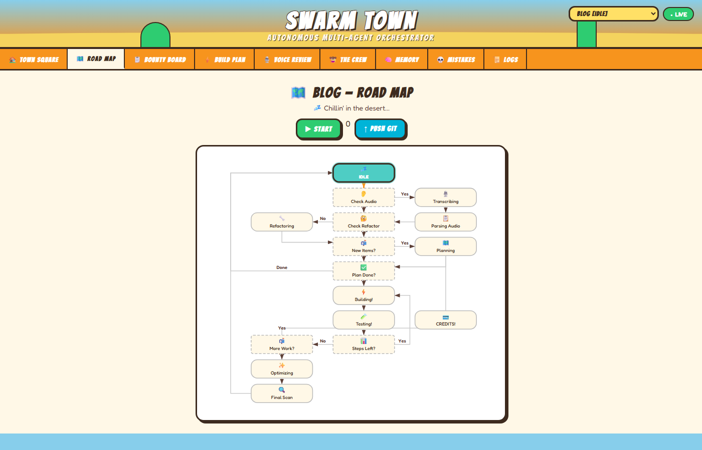

# Swarm Town

**Autonomous multi-repo coding orchestrator powered by Ruflo, Claude Code, and Ralph Wiggum**



---

## What Is This?

One click. Walk away. Your repos get built, tested, and pushed to GitHub — automatically. Swarm Town runs 10+ AI agents per repo in parallel, handles credit exhaustion gracefully, accepts voice code reviews via Telegram, and learns from its mistakes.


## Features

- **Multi-Repo Parallel Execution** — Every repo runs its own orchestrator thread with isolated state
- **Voice Code Reviews** — Record audio, Whisper transcribes, items auto-extracted into the pipeline
- **Telegram Bot** — Control everything from your phone: start/stop repos, send voice notes, get screenshots
- **Credit Recovery** — Detects API credit exhaustion, pauses, auto-resumes when credits return
- **Mistake Memory** — Errors logged and injected into future prompts to prevent repeats
- **Ruflo Swarms** — 215 MCP tools, 10+ agent types (researcher, coder, tester, architect, reviewer...)
- **Ralph Loop** — Persistent autonomous execution via stop hooks
- **Live Dashboard** — Los Lunas cartoon-style UI with real-time state machine visualization
- **Per-Repo Databases** — Isolated SQLite DBs with WAL mode for each repository
- **Auto Git Push** — Commits and pushes after every completed step
- **Log Rotation** — 50MB rotating log files, keeps 3 backups

## Screenshots

### Town Square (Home)
All repo cards with stats, progress bars, and start/stop buttons.


### Road Map (Flow)
State machine SVG with active state highlighted and animation.


### Bounty Board (Issues & Features)
Items with type badges, priority levels, and source tracking.



### Build Plan
Numbered steps with agent types and test results.


### Voice Review
Recording interface with transcription results.



### The Crew (Agents)
Agent grid showing active agents per repo.


### Memory
Namespace/key/value entries with search.



### Mistake Graveyard
Error entries with types, descriptions, and resolutions.



### Logs
Execution log with timestamps, states, and action details.


## Architecture

```
Dashboard (localhost:6969) --> REST API --> Master DB (repo registry)
                                              |
                                    Per-Repo SQLite DBs
                                              |
                                   Repo Orchestrator (per thread)
                                    |-> Ruflo CLI (hive-mind swarms)
                                    |-> Ralph Loop (persistent execution)
                                    |-> Claude Code (--dangerously-skip-permissions)
                                    |-> Whisper (audio transcription)
                                    |-> GitHub (auto push)
                                    |-> grep (fast search)
                                    |-> Telegram Bot (notifications + control)
```

## State Machine

```
IDLE -> CHECK_AUDIO -> TRANSCRIBE -> PARSE_ITEMS -> CHECK_REFACTOR -> DO_REFACTOR
-> CHECK_NEW_ITEMS -> UPDATE_PLAN -> CHECK_PLAN_COMPLETE -> EXECUTE_STEP -> TEST_STEP
-> CHECK_STEPS_LEFT -> CHECK_MORE_ITEMS -> FINAL_OPTIMIZE -> SCAN_REPO -> IDLE
                       Any state -> CREDITS_EXHAUSTED (auto-resume)
```

See [docs/architecture.md](docs/architecture.md) for the full state machine diagram.

## Quick Start

### Prerequisites
- Node.js 18+
- Python 3.10+
- Claude Code CLI (`npm install -g @anthropic-ai/claude-code`)
- Ruflo (`npm install -g ruflo@latest`)

### Install
```bash
# Clone and setup
git clone https://github.com/hotredsam/Orchestrator.git
cd Orchestrator
pip install -r requirements.txt
playwright install chromium

# Initialize Ruflo
npx ruflo init
npx ruflo memory init
```

### Run
```bash
# Start with Telegram bot
python orchestrator.py --start-all --telegram

# Or server only (add repos via dashboard)
python orchestrator.py --server-only

# Dashboard opens at http://localhost:6969
```

### Desktop Launcher
```bash
# macOS: double-click Swarm Orchestrator.command
# Linux: run launch-swarm.sh
# Windows: run launch-swarm.bat or double-click desktop shortcut
```

## Telegram Commands

| Command | What it does |
|---------|-------------|
| `status` | All repo states and stats |
| `start all` | Launch all repos |
| `stop all` | Stop everything |
| `start [repo]` | Start specific repo |
| `stop [repo]` | Stop specific repo |
| `screenshot` | Get dashboard photo |
| `add feature repo: title - desc` | Add feature |
| `add issue repo: title - desc` | Add issue |
| `push [repo]` | Git push |
| `logs [repo]` | Last 5 log entries |
| `mistakes [repo]` | Last 5 mistakes |
| Voice message | Transcribed and items extracted |

## API Reference

See [docs/api-reference.md](docs/api-reference.md) for all endpoints.

Key endpoints:
- `GET /api/repos` — List repos with state and stats
- `POST /api/repos` — Add a repository
- `POST /api/items` — Add feature or issue
- `POST /api/start` — Start orchestration
- `POST /api/stop` — Stop orchestration
- `GET /api/state?repo_id=N` — Current state machine state

## Tech Stack

- **Backend**: Python 3.10+, stdlib HTTP server, SQLite WAL
- **Frontend**: React 18 (CDN), Babel standalone, Google Fonts (Bangers + Fredoka)
- **AI**: Claude Code CLI, Ruflo v3.5 (215 MCP tools), Ralph Wiggum loops
- **Audio**: OpenAI Whisper for transcription
- **Screenshots**: Playwright (headless Chromium)
- **Notifications**: Telegram Bot API
- **Version Control**: git with auto-push

## Testing

```bash
# Start the server first
python orchestrator.py --server-only &

# Run all 100 tests
python -m pytest test_swarm.py -v --tb=short
```

Tests cover: Ruflo CLI (15), Claude Code CLI (10), Per-repo DB (20), Master DB (7), State Machine (16), Runner (10), Credit Recovery (6), API Server (11), Multi-Repo Manager (5).

## License

MIT
